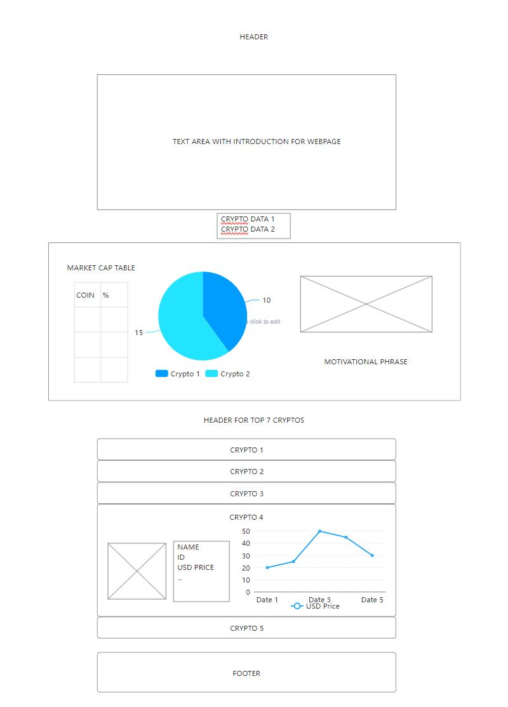

# Crypto Chart Webpage

Welcome to Crypto Chart, your gateway to the fascinating world of cryptocurrencies!

## Overview

Crypto Chart is a web application that provides information about cryptocurrencies and their market trends. Whether you're a seasoned trader, a blockchain enthusiast, or just curious about the world of digital currencies, Crypto Chart has something for you.

## Features

- View the total number of active cryptocurrencies.
- Explore the total market capitalization of cryptocurrencies.
- Get insights into the market cap percentages of various cryptocurrencies.
- Discover the top 7 cryptocurrencies from 15 days ago.
- Access detailed information about each trending cryptocurrency.
- Visualize price trends with interactive charts.

## How to Use

1. Open the [Crypto Chart Webpage](https://dainty-horse-8dab40.netlify.app/).
2. Explore the introduction section to learn more about the world of cryptocurrencies.
3. Check out the global cryptocurrency data and market cap percentages.
4. Dive into the top 7 cryptocurrencies to see their trends.
5. Click on a cryptocurrency to reveal detailed information and price charts.

## Technologies Used

- HTML
- CSS
- JavaScript
- [Chart.js](https://www.chartjs.org/) for chart visualization
- [CoinGecko API](https://coingecko.com/en/api) for cryptocurrency data

## Design

## Author

- Carlos Paz Ortega

Thank you for choosing Crypto Chart as your source for cryptocurrency insights! Start exploring the world of cryptocurrencies today!

**PLEASE NOTE:** When a graphic is not loaded correctly it is because the API fetch was blocked by CORS policy security. In those cases please just wait about 30 seconds and load the page again. Thanks!
